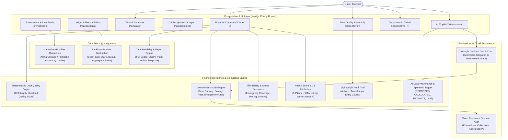

# 💰 FinWise AI — AI-Powered Personal Finance Copilot

[](https://nextjs.org/)
[](https://react.dev/)
[](https://www.typescriptlang.org/)
[](https://tailwindcss.com/)
[](https://firebase.google.com/)
[](https://vitest.dev/)
[](LICENSE)

FinWise AI is a production-grade **AI-Powered Personal Finance Copilot** engineered for deterministic mathematical reliability, data quality auditing, cash flow forecasting, autonomous expense surveillance, and goal pacing.

Unlike traditional expense trackers that merely record past transactions as static rows, **FinWise AI transforms raw banking data into auditable financial intelligence** — answering complex affordability questions (*"Can I afford a ₹50,000 laptop?"*), predicting future cash flow runways up to 90 days ahead, calculating transparent Financial Health Scores with pillar attribution deltas, validating ledger data quality across 12 integrity checks, detecting subscription loads, and simulating multi-variable 5-year financial scenarios.

---

## 🌟 Architecture Diagram



---

## 🚀 Key Modules & Capabilities

### 1. 🔍 Deterministic Financial Data Quality Engine
- **12 Comprehensive Integrity Audits:**
  1. *Missing transaction dates* (`CRITICAL`)
  2. *Invalid / zero / negative amounts* (`CRITICAL`)
  3. *Duplicate transactions matching date, amount & merchant* (`WARNING`)
  4. *Unknown / uncategorized items* (`WARNING`)
  5. *Missing / generic merchant names* (`WARNING`)
  6. *Future-dated transactions* (`WARNING`)
  7. *Suspiciously large outliers (> ₹5,00,000)* (`INFO`)
  8. *Conflicting transaction types (e.g. Salary as outflow)* (`WARNING`)
  9. *Invalid recurring payment patterns* (`INFO`)
  10. *Broken investment records (negative shares / price)* (`CRITICAL`)
  11. *Invalid debt records (negative balance or interest rate > 100%)* (`CRITICAL`)
  12. *Impossible goal values (target <= 0)* (`CRITICAL`)
- **Composite Quality Score (0–100):** Visualized with interactive resolution guidance.

### 2. 📅 Monthly Close Financial Workflow
- End-of-month auditable closing checklist: review Income, Expenses, Transfers, Savings, Investments, Debt payments, and Subscriptions.
- Tracks `reviewedAt`, `reviewedBy`, and `period` in immutable audit records without mutating financial ledgers.

### 3. ⏳ Deterministic Cash Runway & Emergency Fund Planner
- **Cash Runway:** Calculates Essential Monthly Runway (`liquidCash / essentialMonthlyExpenses`) and Total Spending Runway (`liquidCash / totalMonthlyExpenses`).
- **Emergency Fund Planner:** Allows selecting 3, 6, 9, or 12-month burn targets. Calculates exact shortfall, funded percentage, required monthly velocity, and projected completion date.

### 4. 📈 Multi-Period Savings Rate Analyzer
- Deterministic formula: `(Income - Expenses) / Income × 100`.
- Tracks Current Month, Previous Month, 3-Month Average, 6-Month Average, and 12-Month Average. Gracefully handles 0 income, negative savings, and missing months without dividing by zero.

### 5. ⚡ Spending Velocity & Budget Projections
- **Daily Spending Velocity:** `MTD Expenses / Elapsed Days`.
- **Month-End Projections:** `Daily Velocity × Days in Month`.
- Categories marked as `On Track` or `Overrun Projected` with exact mathematical variance and daily remaining allowance. Clearly tagged with `ESTIMATE`.

### 6. 🛒 Affordability Calculator & Financial Stress Testing
- **Affordability Engine:** Deterministically checks purchase price against liquid cash, monthly surplus, and emergency fund buffer. Never gives arbitrary AI guesses.
- **Financial Stress Testing:** Mathematical scenario simulations:
  - Income drop (-10%, -20%)
  - Expense surge (+10%, +20%)
  - Unexpected shocks (₹25,000, ₹50,000, ₹100,000)
  - Explicitly labeled: `SCENARIO — NOT A FORECAST`.

### 7. 🏆 Deterministic Financial Milestones & Health Score Attribution
- **Milestone Detection:** Verified strictly from stored balances (₹1 Lakh savings, ₹5 Lakh net worth, emergency fund capitalized, debt-free, first investment, goal completed).
- **"Why did my score change?":** Transparent attribution displaying exact point changes per pillar (`Savings Rate: +3`, `Budget Discipline: +2`, `Emergency Fund: +1`).

### 8. 🔍 Deterministic Global Search & Filter
- Keyboard shortcut `Cmd/Ctrl + K` supporting search by Merchant, Category, Exact Amount (`5000`), Amount Comparators (`>10000`, `<2000`), Month name (`June`), and Flags (`recurring`, `anomaly`, `income`, `expense`). Simple searches never invoke the LLM.

### 9. 🔐 Audit Trail, Data Portability & Guarded Reset
- **Lightweight Audit Trail:** Tracks user actions (`TRANSACTION_CREATED`, `BUDGET_CREATED`, `DATA_EXPORT`, `DATA_RESET`, `MONTH_REVIEWED`) without credentials.
- **Export My Data:** Structured, sanitized JSON export of all user-owned financial records (transactions, budgets, goals, investments, debts, subscriptions, settings).
- **Financial Snapshot Export:** Point-in-time financial statement from actual stored ledger data.
- **Guarded Reset Records:** Explicit confirmation dialog displaying active record counts and requiring the user to type `RESET`.

---

## 🧪 Testing & Verification

The test suite covers data quality, cash runway, savings rate, emergency fund, velocity, affordability, stress testing, health score attribution, search/filter, and export safety.

```bash
# Run all unit tests
npm test

# Run TypeScript compilation check (0 errors)
npm run typecheck

# Run ESLint audit (0 errors)
npm run lint

# Production build verification (16/16 routes)
npm run build
```

### Verified Test Results
```
 ✓ src/lib/finance/__tests__/csv-parser.test.ts (4 tests)
 ✓ src/lib/finance/__tests__/reconciliation.test.ts (3 tests)
 ✓ src/lib/finance/__tests__/intelligence.test.ts (6 tests)
 ✓ src/lib/finance/__tests__/provenance.test.ts (3 tests)
 ✓ src/lib/finance/__tests__/calculations.test.ts (10 tests)
 ✓ src/lib/finance/__tests__/market-data.test.ts (4 tests)
 ✓ src/lib/finance/__tests__/financial-engineering.test.ts (64 tests)

 Test Files  7 passed (7)
      Tests  94 passed (94)
   Duration  280ms
```

---

## 🔒 Security & Privacy

- **Strict Firestore Rules:** Enforced document ownership where `request.auth.uid == userId` across all subcollections (`transactions`, `budgets`, `goals`, `investments`, `debts`, `alerts`, `reports`, `settings`).
- **No Client Credentials:** API keys remain strictly on the server or in protected environment variables.
- **Client-Side CSV Parsing:** Financial bank statements are parsed in-browser / in secure server actions without transmitting banking passwords to external servers.
- **Non-SEBI Advisory Disclaimer:** Prominently displays educational disclaimers across all AI insights and investment modules.

---

## ⚙️ Environment Variables

Create a `.env.local` file in the root directory:

```env
# Firebase Configuration
NEXT_PUBLIC_FIREBASE_API_KEY=your_firebase_api_key
NEXT_PUBLIC_FIREBASE_AUTH_DOMAIN=your_project.firebaseapp.com
NEXT_PUBLIC_FIREBASE_PROJECT_ID=your_project_id
NEXT_PUBLIC_FIREBASE_STORAGE_BUCKET=your_project.appspot.com
NEXT_PUBLIC_FIREBASE_MESSAGING_SENDER_ID=your_sender_id
NEXT_PUBLIC_FIREBASE_APP_ID=your_app_id

# Google Gemini AI (Genkit Copilot)
GEMINI_API_KEY=your_gemini_api_key

# Optional Market Data Feed (Alpha Vantage / Financial Modeling Prep)
# If omitted, FinWise AI gracefully defaults to its simulated deterministic feed.
MARKET_DATA_PROVIDER=alphavantage
MARKET_DATA_API_KEY=your_alpha_vantage_key
```

---

## 💻 Tech Stack Summary

* **Frontend:** Next.js 15.3.8 (App Router), React 18.3.1, TypeScript 5.0, Tailwind CSS 3.4
* **Components & Styling:** Radix UI, Lucide Icons, Recharts, `class-variance-authority`
* **Backend & Auth:** Firebase Auth, Cloud Firestore (v11), Next.js Server Actions
* **AI & Intelligence:** Google Genkit, Gemini 2.0 Flash
* **Testing:** Vitest 5.0, ESLint 8.57, TypeScript Compiler (`tsc --noEmit`)
