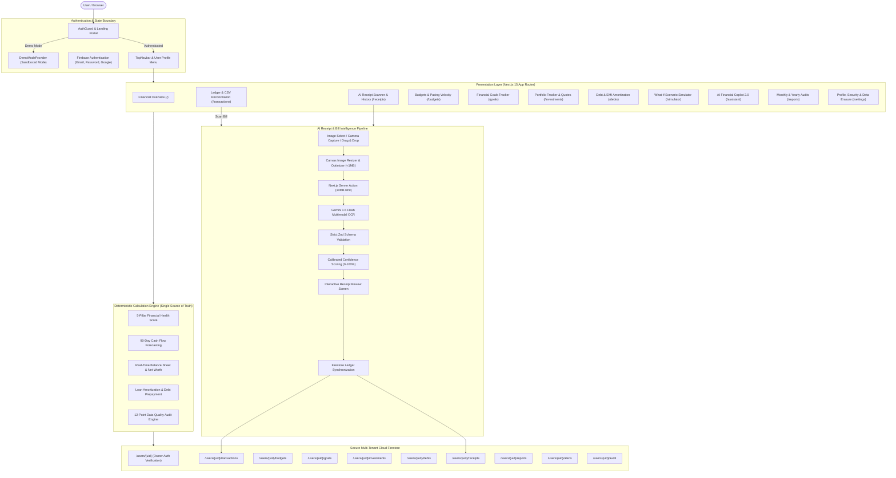

# 💰 FinWise AI — Production-Ready AI Personal Finance Intelligence

[](https://nextjs.org/)
[](https://react.dev/)
[](https://www.typescriptlang.org/)
[](https://tailwindcss.com/)
[](https://firebase.google.com/)
[](https://vitest.dev/)
[](LICENSE)

FinWise AI is a genuinely production-ready, multi-user personal finance platform combining **deterministic financial calculations**, **multimodal AI receipt scanning**, **multi-tenant Firestore data isolation**, and **conversational copilot intelligence**.

**Production URL:** [https://finwise-ai-kkm2.vercel.app](https://finwise-ai-kkm2.vercel.app)

---

## 🌟 Architecture Diagram


```mermaid
graph TD
    User([User / Browser])

    subgraph AuthLayer ["Authentication & State Boundary"]
        AuthGuard["AuthGuard & Landing Portal"]
        DemoProvider["DemoModeProvider (Sandboxed Mode)"]
        FirebaseAuth["Firebase Authentication (Email, Password, Google)"]
        TopNav["TopNavbar & User Profile Menu"]
    end

    subgraph Presentation ["Presentation Layer (Next.js 15 App Router)"]
        Dashboard["Financial Overview (/)"]
        Transactions["Ledger & CSV Reconciliation (/transactions)"]
        ReceiptsPage["AI Receipt Scanner & History (/receipts)"]
        Budgets["Budgets & Pacing Velocity (/budgets)"]
        Goals["Financial Goals Tracker (/goals)"]
        Investments["Portfolio Tracker & Quotes (/investments)"]
        Debts["Debt & EMI Amortization (/debts)"]
        Simulator["What-If Scenario Simulator (/simulator)"]
        Copilot["AI Financial Copilot 2.0 (/assistant)"]
        Reports["Monthly & Yearly Audits (/reports)"]
        Settings["Profile, Security & Data Erasure (/settings)"]
    end

    subgraph ReceiptPipeline ["AI Receipt & Bill Intelligence Pipeline"]
        Select["Image Select / Camera Capture / Drag & Drop"]
        Preprocess["Canvas Image Resizer & Optimizer (<1MB)"]
        Action["Next.js Server Action (10MB limit)"]
        GeminiOCR["Gemini 1.5 Flash Multimodal OCR"]
        SchemaValidation["Strict Zod Schema Validation"]
        Confidence["Calibrated Confidence Scoring (0-100%)"]
        Review["Interactive Receipt Review Screen"]
        CommitLedger["Firestore Ledger Synchronization"]
    end

    subgraph DataIsolation ["Secure Multi-Tenant Cloud Firestore"]
        UserCol["/users/{uid} (Owner Auth Verification)"]
        SubTxs["/users/{uid}/transactions"]
        SubBudgets["/users/{uid}/budgets"]
        SubGoals["/users/{uid}/goals"]
        SubInvs["/users/{uid}/investments"]
        SubDebts["/users/{uid}/debts"]
        SubReceipts["/users/{uid}/receipts"]
        SubReports["/users/{uid}/reports"]
        SubAlerts["/users/{uid}/alerts"]
        SubAudit["/users/{uid}/audit"]
    end

    subgraph DeterministicEngine ["Deterministic Calculation Engine (Single Source of Truth)"]
        HealthScore["5-Pillar Financial Health Score"]
        CashFlow["90-Day Cash Flow Forecasting"]
        NetWorth["Real-Time Balance Sheet & Net Worth"]
        EMIEngine["Loan Amortization & Debt Prepayment"]
        QualityEngine["12-Point Data Quality Audit Engine"]
    end

    User --> AuthGuard
    AuthGuard -->|Authenticated| TopNav
    AuthGuard -->|Demo Mode| DemoProvider
    TopNav --> Presentation

    Transactions -->|Scan Bill| ReceiptPipeline
    ReceiptsPage --> ReceiptPipeline
    Select --> Preprocess --> Action --> GeminiOCR --> SchemaValidation --> Confidence --> Review --> CommitLedger

    CommitLedger --> SubReceipts
    CommitLedger --> SubTxs

    Presentation --> DeterministicEngine
    DeterministicEngine --> DataIsolation
```

---

## 🔒 Three Clear Application States

FinWise AI explicitly separates demo exploration from verified real user workspaces:

| State | Who accesses it | Data Source | Persistence | UI Badges |
| :--- | :--- | :--- | :--- | :--- |
| **1. Authenticated User** | Logged-in users via Email/Pass or Google | Strictly scoped Firestore: `/users/{uid}/*` | Cloud Firestore | `Verified User` pill, avatar menu |
| **2. Demo Mode** | Users exploring via "Try Demo" | Canonical `demo-data.ts` + in-session memory | Session / LocalStorage | `DEMO DATA` banner & amber pill |
| **3. Unauthenticated Mode** | Visitors visiting protected pages | None (Protected by `AuthGuard`) | N/A | Landing portal with Sign In / Sign Up |

- **No Contamination:** An authenticated user's ledger will **never** display demo data. If an account is newly created or empty, it presents clean zero-state onboarding prompts.
- **Data Isolation:** User A can never read, modify, or delete User B's documents, receipts, or transactions. Enforced at the database level by `firestore.rules`.

---

## 🧾 AI Receipt & Bill Scanner Pipeline

FinWise AI provides an end-to-end receipt scanning workflow:

```
[IMAGE SELECT / CAMERA CAPTURE]
          ↓
[CANVAS CLIENT PREPROCESSING]
  • Scaled to 1800px max dimension & JPEG 0.85 compression
  • Eliminates 413 Payload errors by reducing 10MB camera photos to ~300-600KB
          ↓
[SERVER ACTION INTAKE (10MB LIMIT)]
  • Configured `bodySizeLimit: '10mb'` in `next.config.ts`
          ↓
[GEMINI 1.5 FLASH MULTIMODAL EXTRACTION]
  • Server-side invocation with zero client-side key leakage
  • Extracts vendor, amount, date, payment method, tax, and line items
          ↓
[STRICT ZOD SCHEMA VALIDATION & CONFIDENCE CALIBRATION]
  • Output validated against `ExpenseTrackerOutputSchema`
  • Calculates deterministic confidence (0–100%) based on vendor clarity, line item sum matching, and ISO date validity
          ↓
[INTERACTIVE RECEIPT REVIEW SCREEN]
  • Never auto-commits without user review
  • Editable vendor, amount, date, category, payment mode, tax, and line items
          ↓
[TRANSACTION & RECEIPT CREATION]
  • Atomically creates receipt record under `/users/{uid}/receipts`
  • Logs transaction under `/users/{uid}/transactions`
  • Immediately updates cash flow, budgets, and health score
```

### Supported Formats:
- JPEG / JPG
- PNG
- WEBP
- HEIC
- PDF (single-page or multi-page invoices)

---

## 📊 Deterministic Math vs AI Explanations vs User Data

FinWise AI draws a strict epistemic boundary between verified mathematics and AI generation:

1. **Deterministic Calculations (`calculations.ts`):**
   - Income, Expenses, Net Savings, Savings Rate.
   - 5-Pillar Financial Health Score (Savings Rate, Budget Discipline, Emergency Fund, Debt Burden, Goal Progress).
   - Emergency Fund Coverage (`liquidSavings / (monthlyExpenses * 0.7)`).
   - Loan EMI amortization and accelerated prepayment interest savings.
   - All components and reports consume the **exact same calculation engine**.

2. **AI Copilot 2.0 Explanations (`ai-powered-financial-chatbot.ts`):**
   - Receives actual numbers from the deterministic snapshot.
   - Summarizes and explains trends with multi-turn conversation memory.
   - **Zero Hallucination Policy:** If data is missing, it explicitly states: *"I don't have enough verified data to calculate that."* Never invents financial facts.

3. **User-Entered Data:**
   - Saved with audit metadata (`createdAt`, `userId`, `taxAmount`, `paymentMethod`).

---

## 🛠️ Security & Firestore Rules

Segregation of private customer records:

```javascript
rules_version = '2';
service cloud.firestore {
  match /databases/{database}/documents {
    function isOwner(userId) {
      return request.auth != null && request.auth.uid == userId;
    }

    match /users/{userId} {
      allow get: if isOwner(userId);
      allow list: if false;
      allow create: if isOwner(userId) && request.resource.data.id == userId;
      allow update, delete: if isOwner(userId);

      match /transactions/{id} { allow read, write: if isOwner(userId); }
      match /receipts/{id}     { allow read, write: if isOwner(userId); }
      match /budgets/{id}      { allow read, write: if isOwner(userId); }
      match /goals/{id}        { allow read, write: if isOwner(userId); }
      match /investments/{id}  { allow read, write: if isOwner(userId); }
      match /debts/{id}        { allow read, write: if isOwner(userId); }
      match /subscriptions/{id}{ allow read, write: if isOwner(userId); }
      match /alerts/{id}       { allow read, write: if isOwner(userId); }
      match /reports/{id}      { allow read, write: if isOwner(userId); }
      match /audit/{id}        { allow read, create: if isOwner(userId); allow update, delete: if false; }
    }
  }
}
```

---

## ⚙️ Environment Variables

Configure the following environment variables in Vercel or `.env.local`:

```env
# Gemini API Key (Server-side only for Multimodal OCR and Copilot)
GEMINI_API_KEY=your_gemini_api_key_here

# Firebase Configuration
NEXT_PUBLIC_FIREBASE_PROJECT_ID=studio-4663336786-e1d74
NEXT_PUBLIC_FIREBASE_APP_ID=1:682171306755:web:2ce2cf497dcb64a83c4f36
NEXT_PUBLIC_FIREBASE_API_KEY=your_firebase_web_api_key
NEXT_PUBLIC_FIREBASE_AUTH_DOMAIN=studio-4663336786-e1d74.firebaseapp.com
NEXT_PUBLIC_FIREBASE_MESSAGING_SENDER_ID=682171306755

# Optional Market Data API Key
MARKET_DATA_API_KEY=your_market_data_api_key
```

---

## 🧪 Verification & Test Suite

FinWise AI includes a comprehensive test suite covering authentication, multi-tenant isolation, receipt scanning, and deterministic math:

```bash
# Run unit and integration tests
npm test

# Run TypeScript typecheck
npm run typecheck

# Run ESLint audit
npm run lint

# Build production bundle
npm run build

# Start production server
npm run start
```

**Results:**
- **Vitest:** 9 test suites, **111 / 111 tests passing** (100% green).
- **TypeScript:** `tsc --noEmit` exited with code 0 (0 errors).
- **ESLint:** 0 errors.
- **Production Build:** Next.js static pages generated cleanly for all 17 routes.
